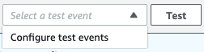
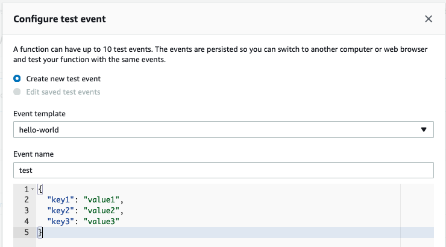

# Bunq2Ynab

Bunq2Ynab is a Python script that synchronizes [bunq](https://bunq.com) accounts with [YNAB](https://youneedabudget.com) accounts.

You'll need a key from both bunq and YNAB to enable synchronization:

1. Create a bunq "API key" in the bunq mobile app. On the profile tab (3rd icon bottom row), click the dots to the top right, then Security & Preferences, then Developers, then API keys, then "Add API Key". Choose to "Reveal" the API key and share it.
2. Create a YNAB "Personal Access Token" in the YNAB website through the top-left menu, then Account Settings, then Developers. Or you can follow this link straight to the Developers page: https://app.youneedabudget.com/settings/developer.

The easiest way to run Bunq2Ynab is in the Amazon cloud. You can also run Bunq2Ynab on a local python installation. Both options are explained below.

## Running on AWS (Serverless)

We've published Bunq2Ynab as Serverless application on the Serverless Application Repository. **This makes it easy for you to deploy the synchronization in the cloud, without running it yourself. Because of the Serverless approach costs should only be a couple of cents a month at most.**

### Deploying the function

1. Navigate to the [Serverless Application Repository](https://console.aws.amazon.com/serverlessrepo/).
2. Click `Public applications`, select `Show apps that create custom IAM roles or resource policies` and search for `bunq-ynab-aws-lambda`.
3. Enter your `BunqApiToken`, `YnabAccessToken`. You can keep `YnabBudget` as `*`.


4. Check the `I acknowledge that this app creates custom IAM roles.` checkbox. An IAM role has to be created to store configuration in Systems Manager Parameter Store.

### Updating the config

Bunq2Ynab will automatically match accounts by name. **If your names match you can continue to 'Activating Sync'.**

We strongly recommend that you name your accounts in YNAB and Bunq the same. **You only need to alter the configuration IF your Ynab account names do NOT match your Bunq account names.**

To alter the configuration:

1. Navigate to [Systems Manager Parameter Console](https://console.aws.amazon.com/systems-manager/parameters/).
2. Click `bunq2ynab-config`, and select `edit`. Populate as follows, make sure you JSON is valid.

```json
{
  "api_token": "AlreadySet",
  "personal_access_token": "AlreadySet",
  "accounts": [
    {
      "bunq_account_name": "your bunq account name",
      "ynab_budget_name": "your ynab budget name",
      "ynab_account_name": "your ynab account name"
    },
    {
      "bunq_account_name": "another bunq account name",
      "ynab_budget_name": "another ynab budget",
      "ynab_account_name": "another ynab account"
    }
  ]
}
```

### Activating Sync

1. After the deployment has finished, navigate to the [Lambda console](https://console.aws.amazon.com/lambda/)
2. Click the function (It should look something like `serverlessrepo-bunq-ynab-aws-lam-Bunq2YnabFunction-<GUID>`
3. Create a test event, you can accept the default hello-world example.



 4. Finally Click `Test` to execute the function once. This will activate the sync from Bunq2Ynab.

- In the log's you'll see `set_callbacks | Adding callback MUTATION:`.

Done! Your transactions should now sync automatically.

## Local Python installation

Bunq2Ynab requires [Python 3.5](https://www.python.org/) or higher. Install this however you like; on my [Raspberry Pi](https://www.raspberrypi.org/products/raspberry-pi-3-model-b/) with [Raspbian](https://www.raspbian.org/), it's `sudo apt-get python3`. You can install the required Python packages with your OS's version of `pip3 install -r requirements.txt`.

1. Clone the repository:

```sh
git clone git@github.com:wesselt/bunq2ynab.git
```

2. Create a file "config.json" with contents like the one below. You can enter `*` or omit the row entirely to have Bunq2Ynab match accounts by name. Note that if you wildcard the YNAB budget name, one bunq account may end up synching with multiple YNAB accounts in different budgets.

```json
{
  "api_token": "your bunq api key",
  "personal_access_token": "your ynab personal access token",
  "accounts": [
    {
      "bunq_account_name": "your bunq account name",
      "ynab_budget_name": "your ynab budget name",
      "ynab_account_name": "your ynab account name"
    }
  ]
}
```

3. Verify that the link with bunq works by requesting the list of users and accounts:

```sh
python3 list_user.py
```

4. Verify that the link with YNAB works by requesting the list of budgets:

```sh
python3 list_budget.py
```

### Manual synchronization

The bunq2ynab.py script synchronizes once.

```sh
python3 bunq2ynab.py
```

Add `--all` to force it to synchronize all transactions. You can run this from a cron job to synchronize on a schedule.

### Automatic synchronization

Run `auto_sync.py` to set up a callback and start listening for push notifications. If you have a private IP, the script will look for a UPNP gateway and set up a port forward.

```sh
python3 auto_sync.py
```

Auto sync tries to run as reliably as possible. Every 8 hours it refreshes the port forward. This way it keeps working when your ISP assigned IP changes. After refreshing the port forward, auto_synch synchronizes even if it has not received a callback.

## Links

- [Bunq API documentation](https://doc.bunq.com/)
- [YNAB API documentation](https://api.youneedabudget.com/)
- [YNAB API endpoints](https://api.youneedabudget.com/v1)
